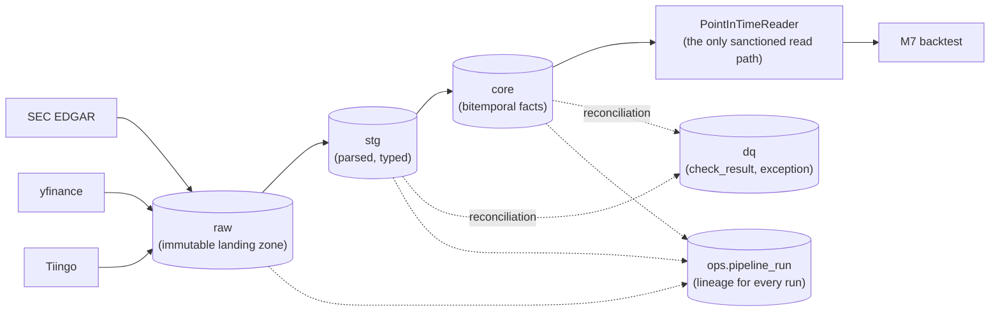
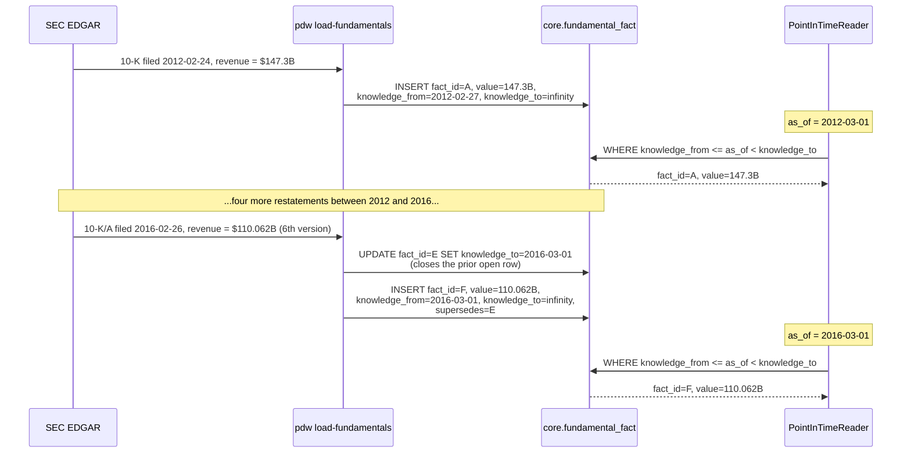

# Architecture

Schema flow, the bitemporal model, and a sequence diagram of a real restatement
(CLAUDE.md 10 — this file was named as landing at M4 in README.md's docs table but was
never actually written until M8's documentation pass caught the gap; see
[docs/postmortems.md](postmortems.md) for the pattern of stale/missing docs this
project has repeatedly found by re-checking its own claims against reality).

## Schema flow

Five Postgres schemas, strict one-way flow, `dq` and `ops` observing:

- **`raw`** — byte-identical vendor responses, hashed (`content_sha256`) and append-only
  (a `BEFORE UPDATE OR DELETE` trigger raises on any attempt to touch a row). Every `core`
  fact traces back to a `payload_id` here — full lineage, no exceptions.
- **`stg`** — parsed and typed, truncated and rebuilt on every `pdw parse` run. No
  constraints beyond column types; deduplication happens downstream in the `core` loader.
- **`core`** — the bitemporal facts (`fundamental_fact`, `price_fact`, `entity`,
  `entity_ticker`). Six invariants enforced as **database constraints**, not application
  logic (see below).
- **`dq`** — `check_result` (one row per check per run, including passes) and `exception`
  (the open → triage → closed lifecycle for a *recurring* failure).
- **`ops`** — `pipeline_run`, the lineage record every `raw.payload` and `dq.check_result`
  row ultimately references.
- **`PointInTimeReader`** — the only sanctioned way to read `core` (direct `SELECT` in
  analysis code is a bug). Every downstream consumer, including the M7 backtest, goes
  through it.

## The bitemporal model

Every fact carries two independent time axes:

| Axis | Columns | Meaning |
|---|---|---|
| **Valid time** | `period_start`, `period_end` | The real-world period a fact describes. "Q2 2024 revenue" has valid time 2024-04-01 → 2024-06-30. |
| **Knowledge time** | `knowledge_from`, `knowledge_to` | The window during which the warehouse believed this value. Opens when the vendor published it (adjusted for availability lag); closes when superseded. |

A restatement never updates a row — it closes the old row's `knowledge_to` and inserts a
new row with the *same* valid time and a later `knowledge_from`, linked via `supersedes`.
Rows in `core` are never deleted or overwritten; both the original and the restated value
stay queryable forever, each correct for a different question ("what did we believe on
date X?" vs. "what's true today?").

### The six invariants (CLAUDE.md 5)

1. **No knowledge-time overlap** — for any `(entity_id, metric_code, period_start,
   period_end, source)`, the `[knowledge_from, knowledge_to)` ranges never overlap.
   Enforced with a `tstzrange` `EXCLUDE USING gist` constraint, not application logic.
2. **Exactly one open row** — at most one row per key has `knowledge_to = 'infinity'`.
3. **`knowledge_from` ≥ `filed_date` + `availability_lag`** — a `CHECK` constraint.
4. **`knowledge_from` < `knowledge_to`** — a `CHECK` constraint.
5. **Full lineage** — every `core` row has a non-null `payload_id` (FK + `NOT NULL`).
6. **`raw` is append-only** — a `BEFORE UPDATE OR DELETE` trigger that raises.

Invariant 1's key includes `period_start`, not just `period_end` — widened after a real
Verizon 10-Q reported both a 3-month and a 6-month year-to-date revenue figure ending on
the same `period_end`, under the same accession: two simultaneously-true facts, not a
restatement of each other. See [docs/postmortems.md](postmortems.md)'s second post-mortem.

## Sequence diagram: a real restatement

GE's FY2011 revenue (CIK `0000040545`), traced through six actually-filed versions — this
is the live scenario M5's accept criteria was verified against (CLAUDE.md 8's M5 note).

Both `as_of=2012-03-01` and `as_of=2016-03-01` are correct answers to different
questions — the loader never overwrites fact A through E, it only ever closes a
knowledge window and opens a new one. A `PointInTimeReader` query for either `as_of`
returns exactly the value that was actually knowable at that instant, verified live
against this exact company and fiscal year.
