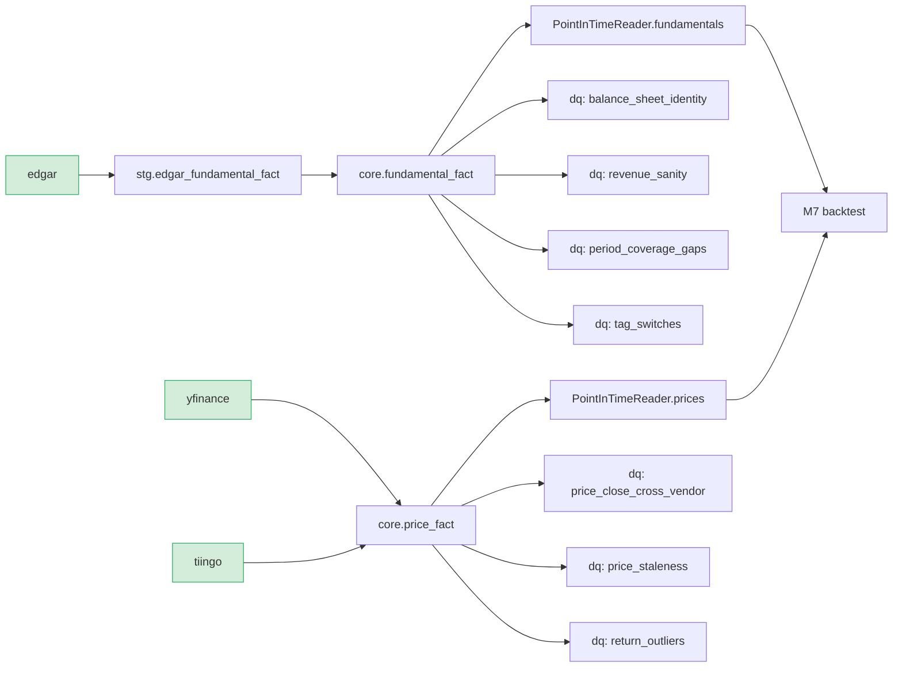

# Dependency DAG

Auto-generated by `pdw ops deps` (CLAUDE.md 8, M8) - node color reflects each feed's current SLA status; a dashed orange border marks everything downstream of a feed that is currently stale or in breach (the blast radius of that feed failing).

