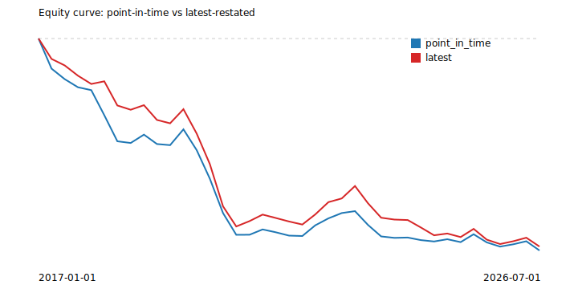

# Findings: point-in-time vs. latest-restated backtest

Naive quarterly-rebalanced earnings-yield long/short over the 50-name universe (CLAUDE.md 8, M7), run twice through the same `PointInTimeReader`-backed pipeline: once with `as_of` fixed to each historical rebalance date, once with `.latest()` for every rebalance. Earnings yield = trailing-twelve-month net income / market cap (diluted weighted-average shares x price, nearest trading day at/after the rebalance date). Long the top 10 names, short the bottom 10, equal-weighted, held one quarter.

**Methodology note on price fields:** market cap uses Tiingo's raw `close` (matches the true historical share count basis); forward returns use yfinance `adj_close` (the correct field for a total-return series). yfinance's own `close` is always split-adjusted by Yahoo's backend regardless of fetch flags (CLAUDE.md 7's M6 amendment) and would silently understate market cap for any ticker that later split within the window.

## Comparison

| Metric | Point-in-time | Latest (restated) |
|---|---|---|
| Cumulative return | -82.39% | -80.87% |
| Sharpe (quarterly, annualized) | -0.72 | -0.68 |
| Avg. turnover per rebalance | 18.3% | 16.8% |
| Rebalance periods | 38 | 38 |

**217 individual position differences** across **38 of 39 rebalance dates** were caused purely by restatement - both runs share the same rebalance schedule and forward-return windows, so any difference in portfolio membership at a given date is attributable to a fundamentals fact having a different value in the point-in-time view than in today's fully-restated view.

## Case studies

Each row traces one restatement that changed portfolio membership at a specific rebalance, back to the exact `fact_id`s and accession numbers of both the original and restated values.

### 1. META — 2017-01-01 rebalance

- Period: 2016-03-31 net income
- Point-in-time: **1,510,000,000** (`fact_id=22885`, accession `0001326801-16-000067`) -> excluded
- Latest (restated): **1,738,000,000** (`fact_id=22886`, accession `0001326801-17-000007`) -> short

### 2. META — 2017-01-01 rebalance

- Period: 2016-06-30 net income
- Point-in-time: **2,055,000,000** (`fact_id=20959`, accession `0001326801-16-000082`) -> excluded
- Latest (restated): **2,283,000,000** (`fact_id=20960`, accession `0001326801-17-000007`) -> short

### 3. META — 2017-01-01 rebalance

- Period: 2016-09-30 net income
- Point-in-time: **2,379,000,000** (`fact_id=893`, accession `0001326801-16-000087`) -> excluded
- Latest (restated): **2,627,000,000** (`fact_id=894`, accession `0001326801-17-000007`) -> short

### 4. GE — 2018-01-01 rebalance

- Period: 2017-03-31 net income
- Point-in-time: **653,000,000** (`fact_id=1461`, accession `0000040545-17-000028`) -> excluded
- Latest (restated): **-83,000,000** (`fact_id=1462`, accession `0000040545-18-000032`) -> short

### 5. GE — 2018-01-01 rebalance

- Period: 2017-06-30 net income
- Point-in-time: **1,367,000,000** (`fact_id=15149`, accession `0000040545-17-000053`) -> excluded
- Latest (restated): **1,057,000,000** (`fact_id=15150`, accession `0000040545-18-000061`) -> short

### 6. GE — 2018-01-01 rebalance

- Period: 2017-09-30 net income
- Point-in-time: **1,836,000,000** (`fact_id=11095`, accession `0000040545-17-000073`) -> excluded
- Latest (restated): **1,360,000,000** (`fact_id=11096`, accession `0000040545-18-000081`) -> short

### 7. QCOM — 2018-01-01 rebalance

- Period: 2017-06-25 net income
- Point-in-time: **866,000,000** (`fact_id=15379`, accession `0001234452-17-000154`) -> excluded
- Latest (restated): **856,000,000** (`fact_id=15380`, accession `0001728949-19-000012`) -> short

### 8. QCOM — 2018-01-01 rebalance

- Period: 2017-09-24 net income
- Point-in-time: **168,000,000** (`fact_id=21791`, accession `0001234452-17-000190`) -> excluded
- Latest (restated): **157,000,000** (`fact_id=21792`, accession `0001728949-19-000012`) -> short

### 9. AMD — 2018-04-01 rebalance

- Period: 2017-07-01 net income
- Point-in-time: **-16,000,000** (`fact_id=19230`, accession `0000002488-17-000156`) -> short
- Latest (restated): **-42,000,000** (`fact_id=19231`, accession `0000002488-18-000128`) -> excluded

### 10. AMD — 2018-04-01 rebalance

- Period: 2017-09-30 net income
- Point-in-time: **71,000,000** (`fact_id=24289`, accession `0000002488-17-000227`) -> short
- Latest (restated): **61,000,000** (`fact_id=24290`, accession `0000002488-18-000189`) -> excluded

### 11. AMD — 2018-04-01 rebalance

- Period: 2017-12-30 net income
- Point-in-time: **61,000,000** (`fact_id=22570`, accession `0000002488-18-000042`) -> short
- Latest (restated): **-19,000,000** (`fact_id=22571`, accession `0000002488-19-000011`) -> excluded

### 12. ORCL — 2019-01-01 rebalance

- Period: 2018-02-28 net income
- Point-in-time: **-4,024,000,000** (`fact_id=12285`, accession `0001193125-18-090646`) -> excluded
- Latest (restated): **-4,047,000,000** (`fact_id=12286`, accession `0001564590-19-008273`) -> short

### 13. QCOM — 2019-01-01 rebalance

- Period: 2018-03-25 net income
- Point-in-time: **363,000,000** (`fact_id=5993`, accession `0001728949-18-000039`) -> short
- Latest (restated): **330,000,000** (`fact_id=5994`, accession `0001728949-19-000012`) -> excluded

### 14. QCOM — 2019-01-01 rebalance

- Period: 2018-06-24 net income
- Point-in-time: **1,219,000,000** (`fact_id=25865`, accession `0001728949-18-000075`) -> short
- Latest (restated): **1,202,000,000** (`fact_id=25866`, accession `0001728949-19-000012`) -> excluded

### 15. INTU — 2019-04-01 rebalance

- Period: 2018-04-30 net income
- Point-in-time: **1,200,000,000** (`fact_id=22163`, accession `0000896878-18-000075`) -> excluded
- Latest (restated): **1,186,000,000** (`fact_id=22164`, accession `0000896878-19-000077`) -> short

### 16. INTU — 2019-04-01 rebalance

- Period: 2018-07-31 net income
- Point-in-time: **49,000,000** (`fact_id=2551`, accession `0000896878-18-000171`) -> excluded
- Latest (restated): **-38,000,000** (`fact_id=2552`, accession `0000896878-19-000132`) -> short

### 17. ADBE — 2020-01-01 rebalance

- Period: 2019-03-01 net income
- Point-in-time: **674,241,000** (`fact_id=18078`, accession `0000796343-19-000079`) -> short
- Latest (restated): **674,000,000** (`fact_id=18079`, accession `0000796343-20-000064`) -> excluded

### 18. ADBE — 2020-01-01 rebalance

- Period: 2019-05-31 net income
- Point-in-time: **632,593,000** (`fact_id=6567`, accession `0000796343-19-000142`) -> short
- Latest (restated): **633,000,000** (`fact_id=6568`, accession `0000796343-20-000143`) -> excluded

### 19. ADBE — 2020-01-01 rebalance

- Period: 2019-08-30 net income
- Point-in-time: **792,763,000** (`fact_id=7819`, accession `0000796343-19-000165`) -> short
- Latest (restated): **793,000,000** (`fact_id=7820`, accession `0000796343-20-000201`) -> excluded

### 20. ADBE — 2020-04-01 rebalance

- Period: 2019-05-31 net income
- Point-in-time: **632,593,000** (`fact_id=6567`, accession `0000796343-19-000142`) -> short
- Latest (restated): **633,000,000** (`fact_id=6568`, accession `0000796343-20-000143`) -> excluded

### 21. ADBE — 2020-04-01 rebalance

- Period: 2019-08-30 net income
- Point-in-time: **792,763,000** (`fact_id=7819`, accession `0000796343-19-000165`) -> short
- Latest (restated): **793,000,000** (`fact_id=7820`, accession `0000796343-20-000201`) -> excluded

### 22. ADBE — 2020-04-01 rebalance

- Period: 2019-11-29 net income
- Point-in-time: **851,861,000** (`fact_id=802`, accession `0000796343-20-000013`) -> short
- Latest (restated): **852,000,000** (`fact_id=803`, accession `0000796343-21-000004`) -> excluded

### 23. WFC — 2020-10-01 rebalance

- Period: 2020-06-30 net income
- Point-in-time: **-2,379,000,000** (`fact_id=14327`, accession `0000072971-20-000288`) -> long
- Latest (restated): **-3,846,000,000** (`fact_id=14328`, accession `0000072971-21-000267`) -> excluded

### 24. WFC — 2021-07-01 rebalance

- Period: 2020-06-30 net income
- Point-in-time: **-2,379,000,000** (`fact_id=14327`, accession `0000072971-20-000288`) -> excluded
- Latest (restated): **-3,846,000,000** (`fact_id=14328`, accession `0000072971-21-000267`) -> long

### 25. WFC — 2021-07-01 rebalance

- Period: 2020-09-30 net income
- Point-in-time: **2,035,000,000** (`fact_id=2598`, accession `0000072971-20-000338`) -> excluded
- Latest (restated): **3,216,000,000** (`fact_id=2599`, accession `0000072971-21-000317`) -> long

### 26. WFC — 2021-07-01 rebalance

- Period: 2021-03-31 net income
- Point-in-time: **4,742,000,000** (`fact_id=27029`, accession `0000072971-21-000221`) -> excluded
- Latest (restated): **4,636,000,000** (`fact_id=27030`, accession `0000072971-22-000113`) -> long

### 27. WFC — 2021-10-01 rebalance

- Period: 2020-09-30 net income
- Point-in-time: **2,035,000,000** (`fact_id=2598`, accession `0000072971-20-000338`) -> excluded
- Latest (restated): **3,216,000,000** (`fact_id=2599`, accession `0000072971-21-000317`) -> long

### 28. WFC — 2021-10-01 rebalance

- Period: 2021-03-31 net income
- Point-in-time: **4,742,000,000** (`fact_id=27029`, accession `0000072971-21-000221`) -> excluded
- Latest (restated): **4,636,000,000** (`fact_id=27030`, accession `0000072971-22-000113`) -> long

### 29. BRK.B — 2022-10-01 rebalance

- Period: 2022-03-31 net income
- Point-in-time: **5,460,000,000** (`fact_id=7416`, accession `0001564590-22-016907`) -> long
- Latest (restated): **5,580,000,000** (`fact_id=7417`, accession `0000950170-23-018438`) -> short

### 30. BRK.B — 2022-10-01 rebalance

- Period: 2022-06-30 net income
- Point-in-time: **-43,755,000,000** (`fact_id=23813`, accession `0001564590-22-028282`) -> long
- Latest (restated): **-43,621,000,000** (`fact_id=23814`, accession `0000950170-23-038705`) -> short

### 31. GE — 2023-04-01 rebalance

- Period: 2022-06-30 net income
- Point-in-time: **-790,000,000** (`fact_id=5114`, accession `0000040545-22-000050`) -> short
- Latest (restated): **-882,000,000** (`fact_id=5115`, accession `0000040545-23-000137`) -> long

### 32. GE — 2023-04-01 rebalance

- Period: 2022-09-30 net income
- Point-in-time: **-165,000,000** (`fact_id=19433`, accession `0000040545-22-000060`) -> short
- Latest (restated): **161,000,000** (`fact_id=19434`, accession `0000040545-23-000137`) -> long

### 33. GE — 2023-04-01 rebalance

- Period: 2022-12-31 net income
- Point-in-time: **2,222,000,000** (`fact_id=1916`, accession `0000040545-23-000023`) -> short
- Latest (restated): **2,197,000,000** (`fact_id=1917`, accession `0000040545-23-000137`) -> long

### 34. BRK.B — 2023-07-01 rebalance

- Period: 2022-06-30 net income
- Point-in-time: **-43,755,000,000** (`fact_id=23813`, accession `0001564590-22-028282`) -> short
- Latest (restated): **-43,621,000,000** (`fact_id=23814`, accession `0000950170-23-038705`) -> long

### 35. BRK.B — 2023-07-01 rebalance

- Period: 2022-09-30 net income
- Point-in-time: **-2,688,000,000** (`fact_id=8296`, accession `0000950170-22-022287`) -> short
- Latest (restated): **-2,798,000,000** (`fact_id=8297`, accession `0000950170-23-058993`) -> long

### 36. MCD — 2023-07-01 rebalance

- Period: 2023-03-31 net income
- Point-in-time: **1,802,300,000** (`fact_id=8417`, accession `0000063908-23-000036`) -> excluded
- Latest (restated): **1,802,000,000** (`fact_id=8418`, accession `0000063908-24-000092`) -> long

### 37. MCD — 2023-10-01 rebalance

- Period: 2023-03-31 net income
- Point-in-time: **1,802,300,000** (`fact_id=8417`, accession `0000063908-23-000036`) -> excluded
- Latest (restated): **1,802,000,000** (`fact_id=8418`, accession `0000063908-24-000092`) -> long

### 38. MCD — 2023-10-01 rebalance

- Period: 2023-06-30 net income
- Point-in-time: **2,310,400,000** (`fact_id=5775`, accession `0000063908-23-000076`) -> excluded
- Latest (restated): **2,310,000,000** (`fact_id=5776`, accession `0000063908-24-000123`) -> long

### 39. MCD — 2024-01-01 rebalance

- Period: 2023-03-31 net income
- Point-in-time: **1,802,300,000** (`fact_id=8417`, accession `0000063908-23-000036`) -> excluded
- Latest (restated): **1,802,000,000** (`fact_id=8418`, accession `0000063908-24-000092`) -> long

### 40. MCD — 2024-01-01 rebalance

- Period: 2023-06-30 net income
- Point-in-time: **2,310,400,000** (`fact_id=5775`, accession `0000063908-23-000076`) -> excluded
- Latest (restated): **2,310,000,000** (`fact_id=5776`, accession `0000063908-24-000123`) -> long

### 41. MCD — 2024-01-01 rebalance

- Period: 2023-09-30 net income
- Point-in-time: **2,317,100,000** (`fact_id=10996`, accession `0000063908-23-000101`) -> excluded
- Latest (restated): **2,317,000,000** (`fact_id=10997`, accession `0000063908-24-000156`) -> long
